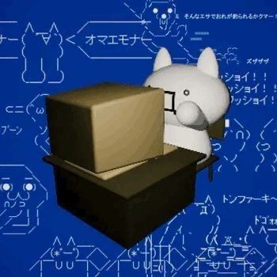

  
**just dude conjuring CLI tomfoolery and go enjoyer.**  

  

### sum  fun facts:

- i consider go as the best tool for every task
- my code is 20% comments 60% random syntax words and 20% hoping it works
- motto: "commit like nobody's watching, push like it never fails"
- i use vim (btw)
- `fmt.Println!("")` debugging enjoyer

### why i'm here

i'm here for the lulz, to break stuff, and sometimes fix things by accident, just enjoy my time. yeah i might write shit ton of spaghetti, unmaintable code with epic commit messages, but this shit gives me so much fun so yeah...
feel free to peek at my repos, fork them, star them, or just laugh at my pain idc.

